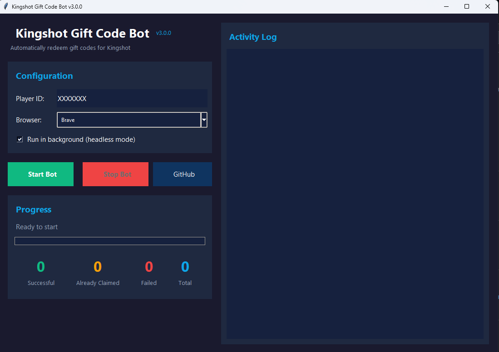

# Kingshot Gift Code Bot

Automated bot for redeeming gift codes in Kingshot game. Automatically fetches active codes from [kingshot.net](https://kingshot.net/gift-codes) and redeems them for your account.

## Screenshot



## Requirements

- Python 3.x
- One of the following browsers:
  - **Google Chrome** (recommended)
  - **Brave Browser** (fully supported)
  - **Microsoft Edge** (fully supported)
  - Any other Chromium-based browser
- ChromeDriver (automatically managed by Selenium)

## Installation

1. Clone or download this repository

2. Install dependencies (automatically or manually):

**Automatic (via GUI/CLI):**
- Just run `python bot.py` and the app will detect missing packages and offer to install them

**Manual:**
```bash
pip install -r requirements.txt
```

3. (Optional) Create a `login_id.txt` file with your Player ID:
```
YOUR_ACCOUNT_ID
```
Note: In GUI mode, you can enter the Player ID directly in the interface

## Usage

### GUI Mode (Recommended - New!)
```bash
python bot.py
```
This will open a graphical interface where you can:
- Enter your Player ID
- Choose headless or visible mode
- See real-time logs with colors
- Monitor progress with a progress bar
- View statistics (successful/failed codes)
- Automatic dependency checking and installation

### CLI Mode (Command Line)

Headless mode (invisible browser):
```bash
python bot.py --cli
```

Visible mode (see the browser):
```bash
python bot.py --cli --visible
```

## How it works

1. Fetches active gift codes from kingshot.net
2. Opens the official redemption page
3. Logs in with your Player ID
4. Redeems each active code automatically
5. Generates a log file with results

## Output

**GUI Mode:**
- Real-time colored logs (blue=info, green=success, red=error, orange=warning)
- Progress bar showing current code being redeemed
- Live statistics counter
- Log file `bot_log_YYYYMMDD_HHMMSS.txt` created with full details
- Summary dialog at completion

**CLI Mode:**
- Console output shows progress in real-time
- Log file `bot_log_YYYYMMDD_HHMMSS.txt` is created with full details
- Summary shows successful/failed redemptions

## Project Structure

```
kingshot-giftcode-bot/
├── bot.py              # Main entry point (launcher)
├── bot_core.py         # Core bot logic (KingshotBotHeadless class)
├── gui.py              # GUI interface (KingshotBotGUI class)
├── utils.py            # Utility functions (dependency check, code fetching)
├── login_id.txt        # Your Player ID (optional, can use GUI)
├── requirements.txt    # Python dependencies
└── bot_log_*.txt       # Generated log files
```

**Modular Design:**
- **bot.py** - Clean entry point with CLI/GUI modes
- **bot_core.py** - Selenium automation logic separated
- **gui.py** - Tkinter GUI in its own module
- **utils.py** - Reusable utility functions

## Features

✨ **New GUI Features:**
- User-friendly graphical interface
- **Multi-browser support**: Auto-detects and allows selection of Chrome, Brave, or Edge
- Automatic dependency detection and installation
- Real-time colored logs
- Progress tracking with visual feedback
- Player ID saved automatically
- Start/Stop controls
- No need to create login_id.txt manually

📝 **General Features:**
- Codes are fetched automatically from kingshot.net
- Only active (non-expired) codes are redeemed
- 3-second delay between each code to avoid rate limiting
- Detailed logging to file and screen
- Headless or visible browser mode
- Works in both GUI and CLI modes
- **Multi-language support**: Works with any language interface (English, Spanish, French, German, Italian, Portuguese, Chinese, Japanese, etc.)

## Disclaimer

This bot is for personal use only. Use at your own risk.

**Legal Notice:** The legality of using automated tools to interact with game services may vary by jurisdiction and may violate the game's Terms of Service. The author does not guarantee that using this bot is legal or permitted. You are solely responsible for ensuring compliance with all applicable laws and terms of service in your region. Use this software at your own risk and responsibility.
